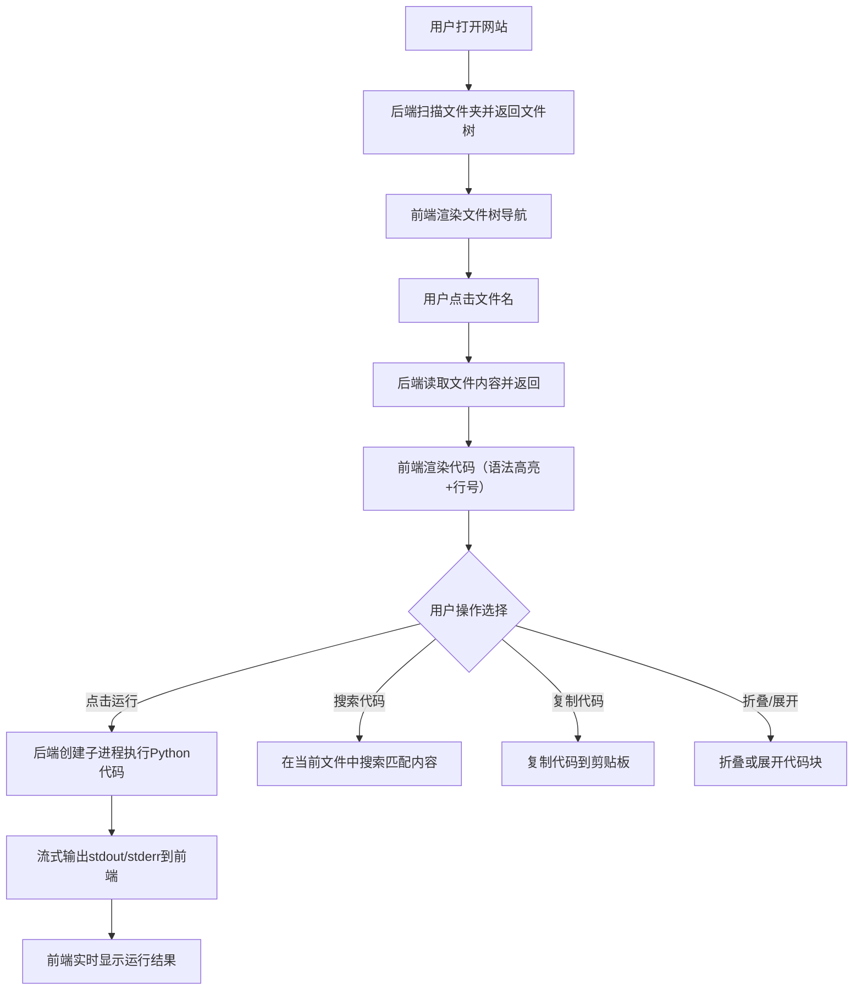

## 1. 产品概述

一个集成式代码浏览与在线执行平台，将指定文件夹内的所有Python和其他程序文件以结构化方式展示，提供语法高亮、行号显示、文件层级导航，并支持在线运行代码，实时查看输出结果。

- **主要目的**：为开发者提供一个统一的代码仓库浏览和执行环境，无需切换多个IDE即可快速查看和运行项目中的程序文件
- **目标用户**：Python开发者、编程学习者、项目维护者
- **核心价值**：集中管理、快速预览、安全执行的代码工作台

## 2. 核心功能

### 2.1 功能模块

1. **文件浏览器**：左侧边栏展示完整文件目录树，支持展开/折叠、按项目分组、文件类型图标标识
2. **代码查看器**：中央区域展示选中文件的源代码，包含语法高亮、行号显示、代码折叠
3. **代码执行器**：右侧面板提供在线运行环境，支持执行Python文件，实时显示stdout/stderr输出
4. **代码操作工具**：复制代码、搜索代码内容、代码块折叠/展开

### 2.2 页面详情

| 页面名称 | 模块名称 | 功能描述 |
|---------|---------|---------|
| 主工作台 | 文件导航树 | 递归扫描指定文件夹，以树形结构展示所有.py及其他程序文件，按项目文件夹分组，支持搜索过滤文件名 |
| 主工作台 | 代码展示区 | Monaco编辑器风格展示源代码，Python语法高亮，行号显示，支持代码折叠/展开，支持选中复制 |
| 主工作台 | 代码执行面板 | 运行按钮触发后端执行Python代码，实时流式返回stdout和stderr输出，显示执行耗时和退出码 |
| 主工作台 | 顶部工具栏 | 文件路径面包屑导航，搜索代码内容按钮，切换主题按钮 |

## 3. 核心流程

## 4. 用户界面设计

### 4.1 设计风格

- **主色调**：深色主题为主，背景色 `#0d1117`（GitHub风格暗色），面板色 `#161b22`，边框色 `#30363d`
- **强调色**：青蓝色 `#58a6ff` 用于链接和交互元素，绿色 `#3fb950` 用于成功/运行状态
- **字体**：代码区使用 `JetBrains Mono`，界面文字使用系统默认中文字体
- **布局**：三栏式布局（文件树 | 代码区 | 执行面板），顶部固定工具栏
- **图标**：使用 Lucide 图标库

### 4.2 页面设计概览

| 页面名称 | 模块名称 | UI元素 |
|---------|---------|-------|
| 主工作台 | 顶部工具栏 | 深色背景，包含Logo、面包屑导航、搜索按钮、主题切换按钮 |
| 主工作台 | 文件导航树 | 左侧面板260px宽，深色背景，树形结构带缩进，文件夹/文件图标，悬停高亮 |
| 主工作台 | 代码展示区 | 中央弹性区域，深色代码编辑器背景，行号列，语法高亮色，代码折叠箭头 |
| 主工作台 | 代码执行面板 | 右侧面板360px宽，包含运行按钮、输出终端（黑色背景绿色/白色文字）、状态指示器 |

### 4.3 响应式设计

- 桌面端优先，三栏布局
- 平板端（<1024px）：文件树可收起，代码区+执行面板上下排列
- 移动端（<768px）：单栏布局，通过底部Tab切换文件树/代码/执行面板

## 5. 安全设计

- 代码执行超时限制（默认30秒）
- 禁止执行危险模块（os.system, subprocess等敏感调用检测）
- 执行进程隔离，限制内存和CPU使用
- 文件读取仅限指定文件夹内