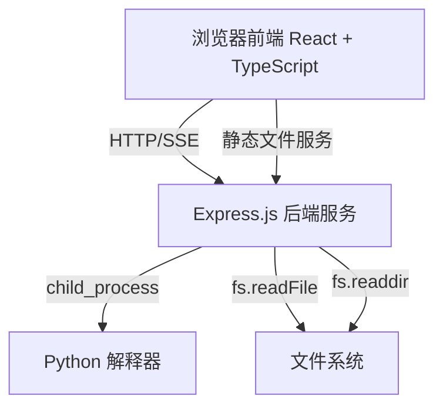
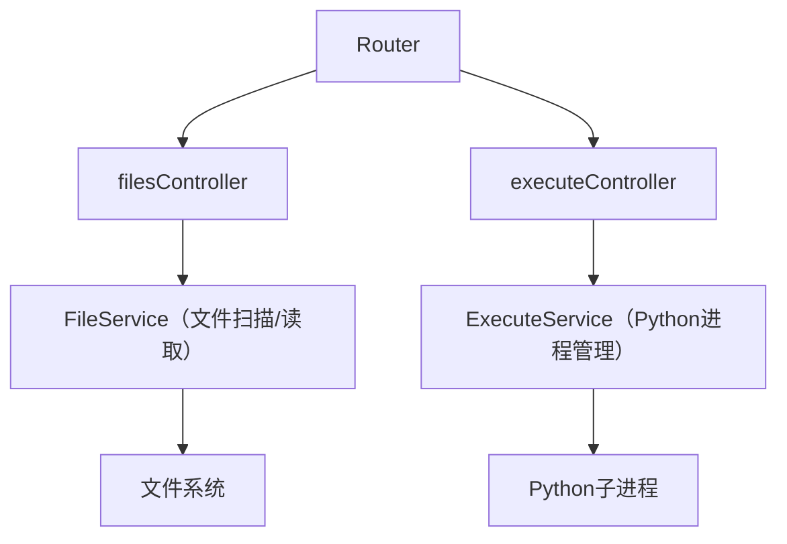

## 1. 架构设计



## 2. 技术说明

- **前端**：React@18 + TypeScript + TailwindCSS@3 + Vite
- **后端**：Express@4 + TypeScript
- **代码高亮**：Shiki（基于TextMate语法，比Prism/Highlight.js更准确）
- **状态管理**：Zustand
- **图标**：Lucide React
- **初始化工具**：vite-init（react-express-ts模板）

## 3. 路由定义

| 路由 | 用途 |
|-----|------|
| / | 主工作台页面（文件浏览+代码查看+执行面板） |

## 4. API定义

### 4.1 获取文件树
```
GET /api/files/tree
Response: {
  name: string,
  type: "file" | "directory",
  path: string,
  children?: FileNode[]
}[]
```

### 4.2 获取文件内容
```
GET /api/files/content?path=xxx.py
Response: {
  path: string,
  content: string,
  language: string
}
```

### 4.3 执行代码
```
POST /api/execute
Body: { filePath: string }
Response: SSE Stream
  event: stdout | stderr | exit
  data: string
```

### 4.4 搜索文件
```
GET /api/files/search?q=keyword
Response: { path: string, name: string }[]
```

## 5. 服务端架构



## 6. 数据模型

本应用无数据库，数据直接从文件系统读取。项目文件夹路径通过环境变量 `CODE_BASE_PATH` 配置，默认为 `../`（即Python文件夹）。

## 7. 项目结构

```
project/
├── src/                    # 前端代码
│   ├── components/
│   │   ├── FileTree.tsx        # 文件树组件
│   │   ├── CodeViewer.tsx      # 代码查看器
│   │   ├── ExecutionPanel.tsx  # 执行面板
│   │   ├── Toolbar.tsx         # 顶部工具栏
│   │   └── SearchDialog.tsx    # 搜索对话框
│   ├── hooks/
│   │   └── useApi.ts           # API调用钩子
│   ├── store/
│   │   └── appStore.ts         # Zustand状态管理
│   ├── pages/
│   │   └── Workspace.tsx       # 主工作台页面
│   ├── utils/
│   │   └── index.ts            # 工具函数
│   ├── App.tsx
│   ├── main.tsx
│   └── index.css
├── api/                    # 后端代码
│   ├── routes/
│   │   ├── files.ts            # 文件路由
│   │   └── execute.ts          # 执行路由
│   ├── services/
│   │   ├── fileService.ts      # 文件服务
│   │   └── executeService.ts   # 执行服务
│   ├── middleware/
│   │   └── security.ts         # 安全检查中间件
│   └── index.ts
├── package.json
├── tsconfig.json
├── vite.config.ts
└── tailwind.config.js
```